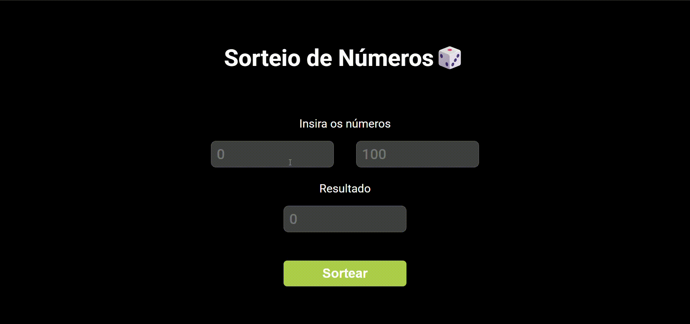

# 🎲 Sorteador de Números (Number Draw)

<p align="center">
  
  
  
</p>

<p align="center">
  
</p>

Um sorteador de números inteiros aleatórios simples, elegante e responsivo, construído com tecnologias web fundamentais (HTML, CSS e JavaScript). O projeto permite que o usuário defina um intervalo numérico customizado e realize o sorteio de um valor contido nele com apenas um clique.

---

## 🚀 Funcionalidades

- **Definição de Intervalo Dinâmico:** Inputs numéricos customizados para estabelecer os valores mínimo e máximo do sorteio.
- **Tratamento de Dados Inteligente:** Filtro matemático que aceita números decimais e os arredonda preventivamente, garantindo que o resultado seja sempre um número inteiro seguro.
- **Interface Dark Mode Nativa:** Design moderno e minimalista com fundo totalmente escuro, transparências sutis e tipografia limpa.
- **Resultado em Tempo Real:** Exibição imediata do número sorteado em um campo protegido contra escrita (`readonly`), evitando manipulações acidentais.

---

## 🛠️ Tecnologias Utilizadas

A pilha de tecnologias utilizada no desenvolvimento deste projeto inclui as três ferramentas fundamentais do desenvolvimento web front-end:

|                                                              Tecnologia                                                               | Finalidade                                                                                                                     |
| :-----------------------------------------------------------------------------------------------------------------------------------: | ------------------------------------------------------------------------------------------------------------------------------ |
|            | **HTML5:** Estruturação semântica e acessível de todos os elementos da interface.                                              |
|              | **CSS3:** Estilização de ponta a ponta, incluindo layout flexível (`display: flex`), controle de opacidade e efeitos `:hover`. |
|  | **JavaScript (ES6):** Lógica matemática do sorteio, captura de dados e manipulação de eventos.                                 |

---

## 🧠 Entendendo a Lógica Matemática

c
A engrenagem principal da aplicação reside no arquivo `script.js`. Quando o botão **Sortear** é acionado, a função executa três etapas lógicas fundamentais:

### 1. Tratamento dos Limites (Arredondamento)

```javascript
const numberMin = Math.ceil(document.querySelector("#numberMin").value);
const numberMax = Math.floor(document.querySelector("#numberMax").value);
```

---

## ⚙️ Como Executar o Projeto

1. Faça o clone deste repositório:
   ```bash
   git clone [https://github.com/anthonyluccas/number-draw.git](https://github.com/anthonyluccas/number-draw.git)
   ```
